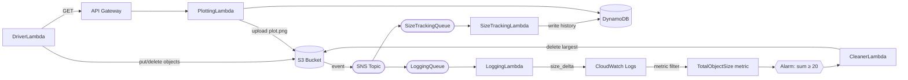

# s3-size-tracker-fanout-cdk

Tracks S3 bucket size over time via SNS/SQS fanout, auto-deletes the largest object when total size crosses a threshold, and plots history as a chart.

## How it works



- Every S3 event fans out via **SNS → 2 SQS queues** to `SizeTrackingLambda` (writes total size to DynamoDB) and `LoggingLambda` (logs size delta to CloudWatch).
- A **metric filter** turns those log deltas into a metric; when the sum crosses the threshold, an **alarm** triggers `CleanerLambda`, which deletes the largest object.
- **PlottingLambda** (behind API Gateway) reads DynamoDB history and uploads `plot.png` back to the bucket.
- **DriverLambda** simulates activity — puts a few small files, waits, then calls the plotting API.

Two CDK stacks: `InfraStack` (bucket, table, SNS/SQS, 4 lambdas, metric filter, alarm), `ApiStack` (API Gateway + driver lambda).

## Prerequisites

- Python 3.x + AWS CDK CLI 
- AWS credentials configured; account CDK-bootstrapped
- Upload `matplotlib` as a Lambda layer in the target account/region

## Run

```powershell
python -m venv .venv
.venv\Scripts\Activate.ps1
pip install -r requirements.txt

cdk deploy --all
```

Then in AWS Console: invoke `DriverLambda` with `{}`, wait ~5 min, download `plot.png` from the bucket.

```powershell
cdk destroy --all   # teardown
```

## Structure

```
app.py                                # CDK entry point
s3_size_tracker_fanout_cdk/
  infra_stack.py                      # bucket, table, SNS/SQS, 4 lambdas, metric filter, alarm
  api_stack.py                        # API Gateway + driver lambda
lambda/                               # all lambdas share this dir; handler picks the file
  driver.py                           # demo orchestrator (puts files, calls API)
  size_tracking.py                    # writes size history to DynamoDB
  logging_lambda.py                   # logs size deltas to CloudWatch
  cleaner.py                          # deletes largest object on alarm
  plotting.py                         # renders chart, uploads plot.png
```

## Gotchas

- Matplotlib layer ARN is hardcoded to version `:4` — update in `infra_stack.py` if yours differs.
- Alarm threshold is `20` bytes; driver puts tiny files (18/28/2 bytes) to cross it.
- `SizeTrackingLambda` uses `list_objects_v2` without pagination — only counts first 1000 objects.
- `plot.png` is special-cased in `logging_lambda.py` and `cleaner.py` so the chart itself isn't tracked or deleted.
- Alarm sums over a single 60s period — repeated firing may not happen if deltas spread across periods.
